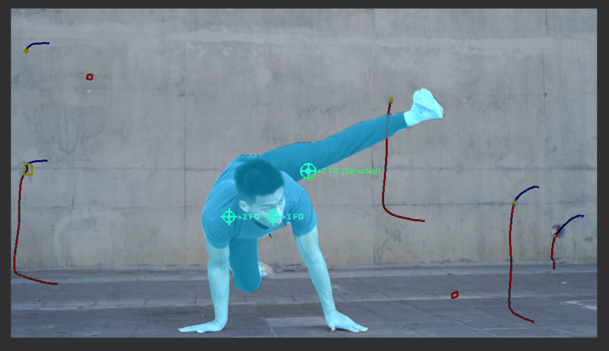
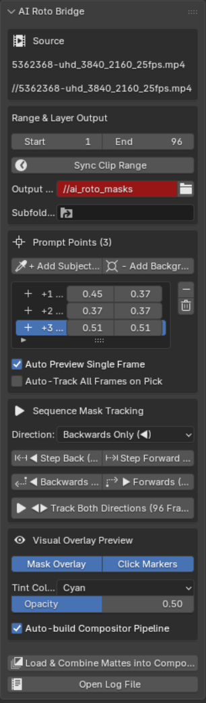
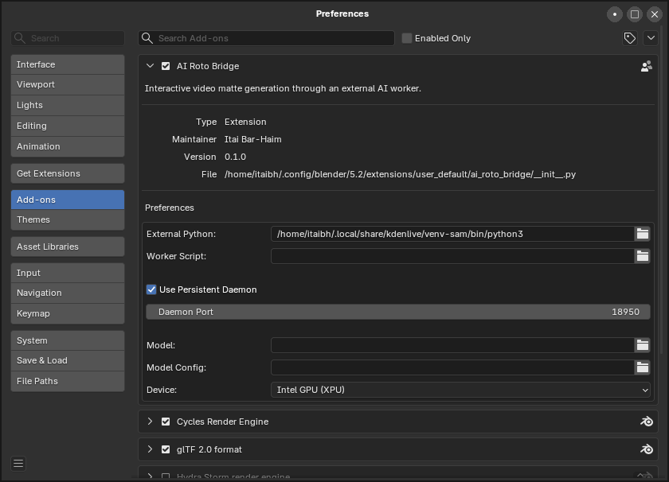

# AI Roto Bridge 0.1

[](https://github.com/sponsors/itaibh)

A Blender 5.2 extension that provides interactive video foreground extraction and automatic mask tracking using **Segment Anything Model 2 (SAM 2)** without polluting Blender's embedded Python environment.



*Interactive point prompting and real-time mask overlay preview (for single-frame previews) in Blender's Movie Clip Editor viewport. Video credit: [Allan Mas on Pexels](https://www.pexels.com/video/man-doing-hip-hop-dance-5362368/)*

## User Interface & Screenshots

| Movie Clip Editor Panel | Extension Preferences |
| :---: | :---: |
|  |  |
| **AI Roto Sidebar Panel**: Add foreground/background prompts, set tracking range & direction, trigger sequence tracking, and configure live visual overlays. | **Extension Preferences**: Set your external Python environment path, background daemon worker, model overrides, and target compute device. |

## Features

- **Movie Clip Editor UX**: Dedicated **AI Roto** sidebar panel in Blender's Movie Clip Editor.
- **Interactive Point Prompting**: Pick foreground (and optional background) target pixels directly on any frame of the video.
- **Sync Clip Range**: One-click synchronization of start/end frame boundaries from the loaded Movie Clip metadata.
- **SAM2 Video Tracking Engine**: `sam2_worker.py` runs SAM2 video predictor (`SAM2VideoPredictor`) with forward and backward tracking propagation starting from the selected prompt frame.
- **Decoupled Architecture**: Communicates via standard `request.json`, allowing SAM2 (or Kdenlive's SAM2 conda/venv environment) to run with full CUDA acceleration independently of Blender.
- **Compositor Integration**: Loads generated `mask_*.png` matte image sequences directly into Blender's Compositor.

## SAM 2 Environment Setup

Ensure your external Python environment (or Kdenlive SAM2 venv) has `torch`, `opencv-python`, `Pillow`, `numpy`, and `sam2` installed:

```bash
pip install torch torchvision
pip install opencv-python pillow numpy
pip install git+https://github.com/facebookresearch/sam2.git
```

In Blender:
1. Go to **Edit > Preferences > Add-ons / Extensions > AI Roto Bridge**.
2. Set **External Python** to the path of your virtual environment's Python (`/path/to/venv/bin/python`).
3. Set **Worker Script** to `sam2_worker.py` (or leave blank to auto-detect).
4. Optionally configure model checkpoint and configuration file paths.

## Build / Install Extension

Install directly into Blender via **Edit > Preferences > Extensions > Install from Disk** (select ZIP or folder).

To rebuild the extension package:

```bash
blender --command extension build --source-dir /path/to/ai_roto_bridge-0.1.0
```

